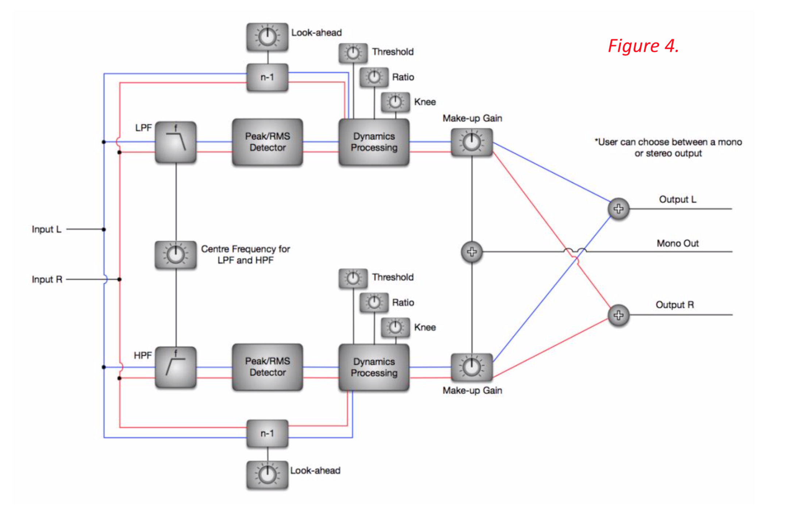

# DualBandCompressor

A dual-band compressor plugin compatible with both mono and stereo inputs, programmed in C++ using the STK toolkit and a JUCE wrapper. Contains all of the common parameters including threshold, ratio, makeup gain, attack, release, knee width and lookahead.

See *Documentation.pdf* for more details.

NOTE: I only had input on 4 files within the respository they are located in the Source folder and titled:

* EffectPlugin.h/cpp
* EffectEditor.h
* EffectExtra.h

The JUCE wrapper was provided by C. Nash of UWE Bristol.

